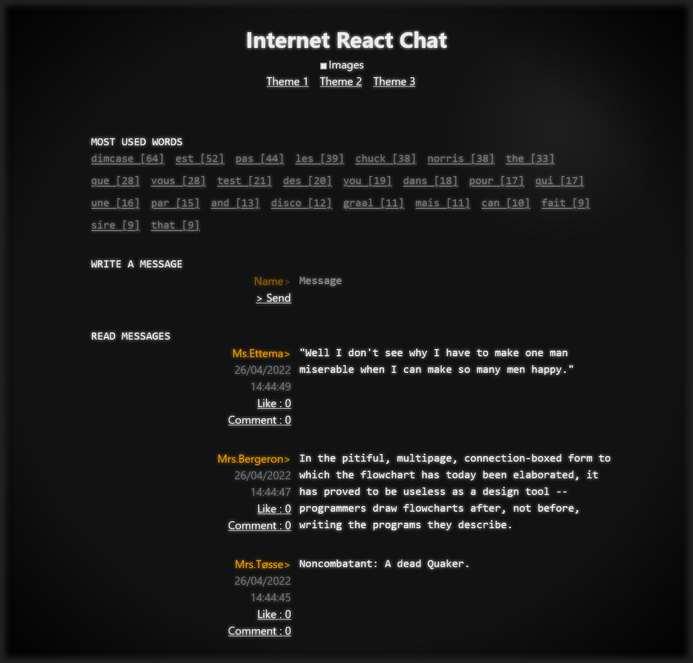

# Internet React Chat

A Twitter-inspired, command-line themed React application. 

Built to practice the [React Library](https://reactjs.org) and communicating with an API using [Fetch](https://developer.mozilla.org/en-US/docs/Web/API/Fetch_API).




*Note that for security reasons, the API url is not made public, thus rendering this application unusable. If you so happen to be  in possession of this url, you should then create the file `/src/ApiUrl.js` containing the following :*

```javascript
const ApiUrl = "https://the_url.com";
export default ApiUrl;
```


